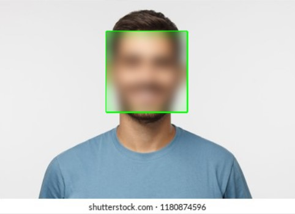

# OpenCv Mini-projects

Computer vision is a field of artificial intelligence that trains computers to interpret and understand the visual world. Using digital images from cameras and videos and deep learning models, machines can accurately identify and classify objects — and then react to what they “see.”

OpenCV (Open Source Computer Vision Library) is a library of programming functions mainly aimed at real-time computer vision. Originally developed by Intel, it was later supported by Willow Garage then Itseez. The library is cross-platform and free for use under the open-source BSD license.

## Blur the Face

Use GaussianBlur with a kernel of (91,91) to blur faces. It can be used for Privacy & Identity Protection in public/private areas. Can increase or decrease blur strength by changing the kernel.

### Usage

- Cloning the Repository: 

        git clone https://github.com/theAdarshSrivastava/OpenCv
        
- Entering the directory: 

        cd OpenCv
        
- Setting up the Python Environment with dependencies:

        pip install -r requirements.txt
        
- Entering the directory: 

        cd Blur_Face

- Running the file:

        python3 Blur face.py

## Color Detection

Color detection is the process of detecting the name of any color. Color detection is necessary to recognize objects, it is also used as a tool in various image editing and drawing apps. Some Real-world Applications:-

In self-driving car, to detect the traffic signals.
Multiple color detection is used in some industrial robots, to performing pick-and-place task in separating different colored objects.

### Usage

- Cloning the Repository: 

        git clone https://github.com/theAdarshSrivastava/OpenCv
        
- Entering the directory: 

        cd OpenCv
        
- Entering the directory: 

        cd Color_Detection

- Running the file:

        python3 color_detection.py

## Face Recognition

Face recognition is a method of identifying or verifying the identity of an individual using their face. Face recognition systems can be used to identify people in photos, video, or in real-time. Law enforcement may also use mobile devices to identify people during police stops.

### Usage

- Cloning the Repository: 

        git clone https://github.com/theAdarshSrivastava/OpenCv
        
- Entering the directory: 

        cd OpenCv
        
- Entering the directory: 

        cd Face_Detection

- Running the file:

        python3 Face Detection.py

## Image-to-sketch

A small code that can convert an image to a pencil sketch like image. An image is basically an array of numbers to Python. So we can perform a variety of matrix manipulations to get some very interesting results. This code shows how to reduce an image into a ‘pencil’ outline.

### Usage

- Cloning the Repository: 

        git clone https://github.com/theAdarshSrivastava/OpenCv
        
- Entering the directory: 

        cd OpenCv
        
- Entering the directory: 

        cd Image_to_Sketch

- Running the file:

        python3 Pencil sketch.py

## Cartoonize Image

Cartooning of an image is done by using opencv and python. There is a use of Bilateral Filter on the image to smoothen the image. Use of Median filter to reduce noise from the image. Use of Adaptive Thresholding for image segmentation.

### Usage

- Cloning the Repository: 

        git clone https://github.com/theAdarshSrivastava/OpenCv
        
- Entering the directory: 

        cd OpenCv
        
- Entering the directory: 

        cd Cartoonize_Image

- Running the file:

        python3 Cartoonise Images.py

